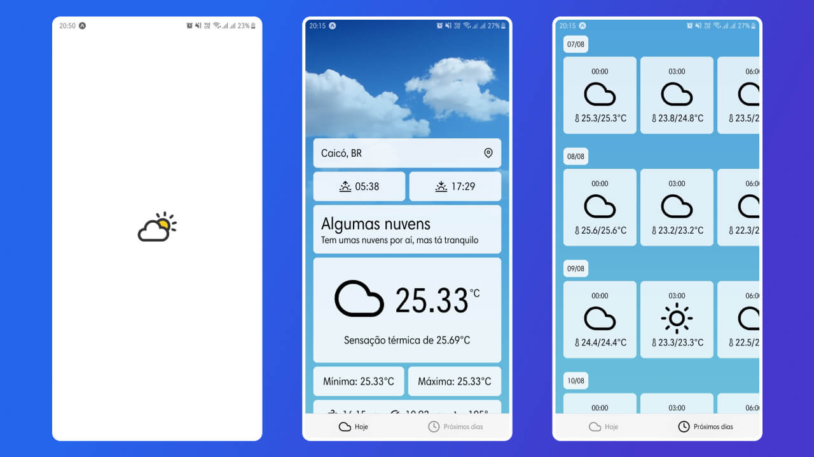

# Weather

Aplicativo de previsão do tempo construído a partir do consumo da [API OpenWeather](https://openweathermap.org/api) com React Native.

Esse projeto foi construído seguindo um [tutorial em vídeo](https://www.youtube.com/watch?v=obH0Po_RdWk) porém eu o estilizei de maneira diferente.




## Executando localmente

1. Crie uma conta da OpenWeather API para obter uma chave de acesso

2. Baixe o projeto para sua máquina

3. Copie o arquivo `.env.example` e o renomeie como `.env`

4. Cole sua chave no aquivo `.env`

5. Instale as dependências com a execução do comando `npm i`

6. Inicie a execução do servidor com o comando a seguir

   ```bash
   npm start
   ```

7. Abra o aplicativo [Expo](https://play.google.com/store/apps/details?id=host.exp.exponent&hl=pt_BR&gl=US) no seu aparelho e escaneie o código QR exibido no terminal

   - Caso a execução apresente erro de conexão, aperte Ctrl C no terminal para
   parar o servidor e o execute novamente com o comando a seguir
  
     ```bash
     npm start -- --tunnel
     ```
